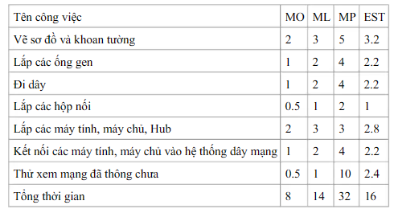
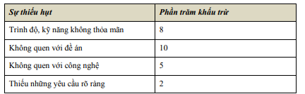

# Ước lượng thời gian dự án

## 1. Ước lượng thời gian dự án là gì?
Ước lượng thời gian dự án là một quá trình ước lượng thời gian cần thiết để hoàn thành một công việc hoặc dự án.

## 2. Các kỹ thuật ước lượng thời gian dự án
### 2.1. Kỹ thuật ước lượng dựa trên kinh nghiệm
Kỹ thuật này dựa trên kinh nghiệm chủ quan, cảm tính của các chuyên gia.
- **Ưu điểm**: Nhanh chóng, phù hợp các dự án mới chưa có dữ liệu lịch sử.
- **Nhược điểm**: Các chuyên gia khác nhau có thể đưa ra các ước lượng hết sức khác nhau. Chỉ nên dùng khi đội ngũ chuyên gia có đủ kinh nghiệm, kỹ năng tốt, đội hình cố định. 
Hoặc do dự án đã quy định

### 2.2. Kỹ thuật ước lượng dựa theo lịch sử
Kỹ thuật này dựa trên dữ liệu lịch sử của các dự án tương tự đã hoàn thành trước đó. Thường không được xem là cách ước lượng chính thống.
- **Ưu điểm**: Dựa trên dữ liệu lịch sử nên chính xác hơn, dễ thực hiện. Kết quả ước lượng sẽ rất đáng tin cậy nếu có một số lượng dự án tương tự cùng loại và gần giống nhau.
- **Nhược điểm**: Cần có dữ liệu lịch sử, không phù hợp với các dự án mới, không có dữ liệu lịch sử.

### 2.3. Kỹ thuật ước lượng dựa theo công thức Pert
Kỹ thuật này dựa trên công thức Pert, dựa trên 3 ước lượng thời gian: ước lượng tối thiểu (O), ước lượng tối đa (P), ước lượng trung bình (M).

> - Ước lượng tối thiểu (O): Là ước lượng thời gian cần thiết để hoàn thành công việc nếu mọi điều kiện thuận lợi.

> - Ước lượng tối đa (P): Là ước lượng thời gian cần thiết để hoàn thành công việc nếu mọi điều kiện không thuận lợi.

> - Ước lượng trung bình (M): Là ước lượng thời gian cần thiết để hoàn thành công việc nếu mọi điều kiện bình thường hay hợp lí.

Ước lượng thời gian cần thiết để hoàn thành công việc được tính theo công thức Pert: `TE = (O + 4M + P) / 6`

**Ví dụ:**
1. Một công việc ước lượng tối thiểu là 2 ngày, ước lượng trung bình là 4 ngày, ước lượng tối đa là 6 ngày. Thì thời gian ước lượng cần thiết để hoàn thành công việc là: `TE = (2 + 4*4 + 6) / 6 = 4 ngày`
2. Bảng ước lượng thời gian theo công thức Pert của công việc lắp mạng LAN:

- **Ưu điểm**:
    - Tính đến rất nhiều yếu tố ảnh hưởng đến thời gian hoàn thành công việc,  buộc người quản lý dự án phải trao đổi với nhiều người liên quan (nếu muốn có được O, P, M chính xác).
    - Giá trị nhận được là giá trị cân bằng giữa O, P, M => có ý nghĩa và đáng tin cậy.

- **Nhược điểm**:
    - Cần nhiều thời gian và công sức để có được O, P, M chính xác.
    - Có thể dẫn đến những tính toán rất vụn vặt, không cần thiết.

### 2.4. Kỹ thuật ước lượng dựa theo hệ số năng suất toàn cục (GEF - Global Efficiency Factor)
Phương pháp này này hợp thêm thời gian phi sản xuất vào ước lượng. Ban đầu giả sử mỗi người được gán 100% năng suất. Sau đó, người quản lý dự án tính toán thêm các hệ số phi sản xuất, mỗi mục được gán một tỉ lệ phần trăm liên quan đến từng cái khác. Kế đó khấu trừ tỉ lệ phần trăm từ 100% để rút ra sự ước lượng thực tế nhất, theo bảng sau:

**Ví dụ:** công việc thiết kế sitemap cho khách hàng.

Năng suất toàn cục: `100% + 25% = 125%`

Ước lượng thời gian hoàn thành công việc lý tưởng (khi làm với 100% năng suất): `100 giờ`

Thời gian ước lượng cuối cùng (khi làm với 125% năng suất): `100 giờ * 125% = 125 giờ`

- **Ưu điểm**:
    - Khi điều chỉnh bảng "khiếm khuyết" có thể dễ dàng thay đổi lại thời gian ước lượng.
    - Thuận tiện, hay được sử dụng
- **Nhược điểm**:
    - Phần trăm khấu trừ thường là do chủ quan, do đó nó lệch theo ý kiến chủ quan của người ưóc lượng.

<!-- ### 2.5. Kỹ thuật ước lượng dựa theo man-month (MM) -->

## 3. Những lưu ý khi ước lượng thời gian dự án
- **Lưu ý 1**: Trước khi ước lượng thời gian cho công việc, nên xem lại WBS đã viết đủ rõ ràng, chi tiết chưa.
- **Lưu ý 2**: Với các công việc gần giống nhau, ước lượng thời gian cũng gần giống nhau.
- **Lưu ý 3**: Phân chia chi tiết công việc sẽ cho ước lượng chính xác hơn.
- **Lưu ý 4**: Mỗi ước lượng chi tiết không nên quá 8 giờ.
- **Lưu ý 5**: Việc ước lượng mang tính chủ quan. Do đó nếu có thể kết hợp được với những ý kiến đánh giá độc lập từ nhiều người thì sẽ tốt hơn.
- **Lưu ý 6**: Không bao giờ có được ước lượng chính xác hoàn toàn. Cố gắng sao cho có được ước lượng hợp lý.
- **Lưu ý 7**: Nên viết tài liệu khi ước lượng. Tài liệu này là cơ sở để trao đổi với mọi người, đồng thời cũng mang tính chất một bản cam kết (về tâm lý) của những người sau này sẽ tham gia công việc.
- **Lưu ý 8**: Khi ước lượng thời gian quá cao so với dự kiến:
    - Kiểm chứng lại để khẳng định tính hợp lý của ước lượng (có ước lượng nào bị đánh giá quá cao không?).
    - Thu hẹp phạm vi dự án bằng cách phát triển phiên bản nhỏ hơn thiết kế gốc (với sự đồng ý của khách hàng).
- **Lưu ý 9**: Khi ước lượng thời gian quá thấp so với dự kiến:
    - Thường do sự lạc quan của người ước lượng. Cần phải kiểm chứng lại, và nếu cần thiết thì điều chỉnh lại ước lượng.
- **Lưu ý 10**: Ước lượng là một quá trình lặp, cần được hiệu 
chỉnh dần. Do đó cần có các sự kiện mốc để
dừng lại, tính toán thời gian để đạt tới mốc đó 
và ước lượng lại ngày tháng cho các mốc tiếp 
theo nếu cần, dựa trên kinh nghiệm đã có

## 4. Các bước khi làm ước lượng thời gian dự án
1. Có được WBS chi tiết, rõ ràng. 

    WBS là tài liệu cơ bản để ước lượng thời gian dự án. Nếu WBS chưa rõ ràng, chi tiết, thì ước lượng thời gian dự án sẽ không chính xác.
2. Lập bảng ước lượng thời gian dự án.
    
    Bảng ước lượng thời gian dự án là một bảng gồm các công việc chi tiết cần làm được lấy ra từ WBS, và thời gian ước lượng cần thiết cho từng công việc.
3. Lập danh sách những người cần trao đổi - những người có liên quan đến công việc.
    
    Những người cần trao đổi có thể là người thực hiện công việc, người quản lý dự án, người quản lý sản phẩm, người quản lý kỹ thuật, người quản lý chất lượng, người quản lý dự án, khách hàng,...
4. Tiến hành trao đổi với từng người để tính toán thời gian ước lượng.
    
    Thời gian ước lượng cần thiết cho từng công việc được ước lượng dựa trên các kỹ thuật ước lượng thời gian dự án, có thể phối hợp nhiều phương pháp ước lượng.
5. Họp chung với tất cả mọi người để trao đổi về thời gian ước lượng cũng như điều chỉnh lại nếu cần thiết.
    
    Khi đã có được thời gian ước lượng cần thiết cho từng công việc, cần phải họp chung với tất cả mọi người có liên quan để trao đổi về thời gian ước lượng.
5. Ghi chép lại kết quả trao đổi và lấy chữ ký của mọi người có liên quan để tạo được sự cam kết.
    
    Kết quả trao đổi cần phải được ghi chép lại, và lấy chữ ký của mọi người có liên quan để có được một bản cam kết (về tâm lý) của những người sau này sẽ tham gia công việc.
6. Phân phát biên bản trao đổi cho mọi người có liên quan để họ có thể tham khảo lại nếu cần thiết.
    
## 5. Những hậu quả khi ước lượng thời gian dự án không chính xác
- **Hậu quả 1**: Dự án hoàn thành trễ hạn.
    - Nếu thời gian ước lượng quá ít, dự án có thể bị đặt trong một kế hoạch không thực tế. Kết quả là dự án không thể hoàn thành đúng tiến độ đã cam kết, gây trễ hẹn
- **Hậu quả 2**: Đánh mất niềm tin của khách hàng.
- **Hậu quả 3**: Làm căng thẳng những người tham gia dự án.
    -  Khi mà họ phải làm việc quá sức để cố gắng hoàn thành công việc theo thời gian ước lượng quá ít này.
- **Hậu quả 4**: Làm ảnh hưởng đến chi phí lợi nhuận của dự án, thậm chí có thể làm dự án bị lỗi.
    -  Nếu thời gian được ước lượng quá ngắn, nhóm dự án có thể phải sử dụng nhiều nguồn lực hơn để hoàn thành công việc, dẫn đến sự tăng chi phí không mong muốn. 
    -  Hoặc nếu thời gian ước lượng quá dài, dự án có thể bị lãng phí nguồn lực, dẫn đến sự giảm lợi nhuận.

## 5. Câu hỏi 

1. Khi đang làm việc, nhân sự bị gián đoạn do điện thoại gọi, có người tìm,... nhân sự phải mất một ít thời gian mới lấy lại được trạng thái làm việc như lúc trước khi bị gián đoạn. Sự gián đoạn này làm mất thời gian cũng như năng xuất làm việc. Vậy có cách nào để ước lượng thời gian mất do gián đoạn này không?

> Có, có thể sử dụng kỹ thuật ước lượng dựa theo hệ số năng suất toàn cục (GEF - Global Efficiency Factor) để ước lượng thời gian mất do gián đoạn này. Ngoài ra, có thể khống chế gián đoạn này bằng cách đưa ra những qui định, qui chế về tiếp khách riêng, gọi điện thoại, check mail,.. trong giờ làm việc.

2. Khi ước lượng thời gian quá cao so với dự kiến, cần làm gì?

> Kiểm chứng lại để khẳng định tính hợp lý của ước lượng (có ước lượng nào bị đánh giá quá cao không?). Thu hẹp phạm vi dự án bằng cách phát triển phiên bản nhỏ hơn thiết kế gốc (với sự đồng ý của khách hàng).

3. Trong công thức Pert, ước lượng thời gian được tính bằng `TE = (O + 4M + P) / 6`. Mà O, P, M ta lại phải ước lượng để có được. Vậy thì có đảm bảo rằng thời gian ước lượng `TE` nhận được là chính xác không?

> Thời gian ước lượng `TE` nhận được không đảm bảo là chính xác. Tuy nhiên, nó là giá trị cân bằng giữa O, P, M. Điều này có ý nghĩa là nó sẽ có khả năng bị sai lệch lớn ít hơn so với việc ước lượng dựa trên một giá trị duy nhất. 

4. Cấp trên luôn mong muốn công việc được hoàn thành nhanh chóng, còn nhân viên thì luôn muốn có thời gian làm việc thoải mái. Vậy làm thế nào để ước lượng thời gian công việc mà vẫn đảm bảo cả hai yêu cầu trên?

> Tham khảo ý kiến của cả cấp trên và nhân viên, và cố gắng tìm ra một giá trị cân bằng giữa hai yêu cầu trên. 

5. Vì sao phân chia chi tiết công việc sẽ cho ước lượng chính xác hơn?

> Phân chia chi tiết công việc sẽ giúp ước lượng chính xác hơn vì nó giúp nhìn rõ ràng hơn về công việc cần làm, từ đó giúp ước lượng thời gian cần thiết cho từng công việc cụ thể hơn.

6. Mỗi ước lượng chi tiết không nên quá 8 giờ. Vì sao lại là 8 giờ?

> 8 giờ là thời gian làm việc một ngày của người lao động. Nếu một công việc chi tiết mà mất quá 8 giờ, có thể nó sẽ không còn là một công việc chi tiết nữa, mà là một công việc lớn hơn. 

7. Kết hợp ý kiến đánh giá độc lập từ nhiều người thì ước lượng thời gian dự án tốt hơn. Vì sao?

> Vì ước lượng là một quá trình chủ quan, do đó nếu có thể kết hợp được với những ý kiến đánh giá độc lập từ nhiều người thì sẽ tốt hơn. 

8. Phối hợp nhiều phương pháp ước lượng thời gian dự án sẽ giúp ước lượng chính xác hơn không?

> Vì mỗi phương pháp ước lượng thời gian dự án có những ưu điểm và nhược điểm riêng, do đó phối hợp nhiều phương pháp ước lượng thời gian dự án sẽ giúp ước lượng chính xác hơn. 

9. Làm gì khi WBS chưa viết đủ rõ ràng, chi tiết?

> Trước khi ước lượng thời gian, nên xem lại WBS đã viết đủ rõ ràng, chi tiết chưa. Nếu chưa, cần phải viết WBS đủ rõ ràng, chi tiết trước khi ước lượng thời gian dự án. Vì WBS là tài liệu cơ bản để ước lượng thời gian dự án. Nếu WBS chưa rõ ràng, chi tiết, thì ước lượng thời gian dự án sẽ không chính xác.

10. Phương pháp sử dụng kỹ thuật ước lượng dựa theo lịch sử của các dự án tương tự đã hoàn thành trước đó thường không được xem là cách ước lượng chính thống. Vì sao?

> Phương pháp sử dụng kỹ thuật ước lượng dựa theo lịch sử của các dự án tương tự đã hoàn thành trước đó thường không được xem là cách ước lượng chính thống vì nó có những hạn chế và không phù hợp với tất cả các dự án. Thường không phù hợp với các dự án mới, không có dữ liệu lịch sử.

11. Khi ước lượng thời gian dự án, cần phải viết tài liệu. Tại sao?

> Khi ước lượng thời gian dự án, cần phải viết tài liệu. Tài liệu này là cơ sở để trao đổi với mọi người, đồng thời cũng mang tính chất một bản cam kết (về tâm lý) của những người sau này sẽ tham gia công việc, đồng thời là cơ sở để những dự án sau có thể tham khảo.

12. Phần lớn các dự án đều nhận được hạn thời gian từ khách hàng. Nhưng không phải lúc nào hạn thời gian này cũng phù hợp với thực tế. Nếu hạn thời gian từ khách hàng không phù hợp với thực tế, làm thế nào?

> Thảo luận và giải thích

> Đề xuất các phương án thay đổi, có thể gia tăng tài nguyên, giảm phạm vi dự án, thay đổi công nghệ,.. để có thể hoàn thành dự án theo hạn thời gian từ khách hàng.

> Đánh giá lại dự án: đánh giá lại các rủi ro, cơ hội, chi phí, lợi nhuận,.. để xem xét xem có nên tiếp tục dự án không.

